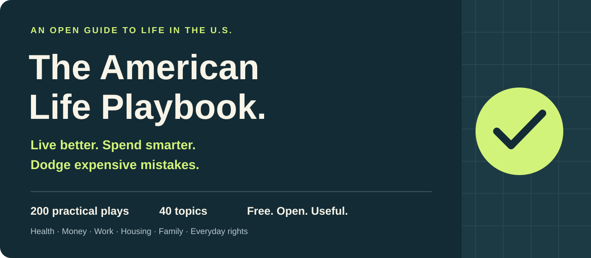

# The American Life Playbook

**Life in the U.S. is expensive. Learning how it works should be free.**

200 practical plays across 40 topics to protect your health, money, time, and rights. Built for people living in the United States: the medical bill on your desk, the benefits you might qualify for, the job offer you need to compare, and the family decisions nobody handed you a manual for.

**[Start with one useful move →](START-HERE.md)** · **[Find your situation](SCENARIOS.md)** · **[Copy a script](TEMPLATES.md)** · **[Browse all 40 topics](#the-playbook)**

**200 detailed plays · 40 topics · 12 situation checklists · 10 scripts · Offline search**

## Find what you need today

| If you are thinking… | Start here |
| --- | --- |
| “This medical bill cannot be right.” | [Review the bill and ask about financial assistance](guide/04-health-insurance.md#044-request-bill-review-and-financial-assistance-before-borrowing) |
| “I just lost my job.” | [The first-week checklist](SCENARIOS.md#1-i-lost-my-job) |
| “I work hard. Where does the money go?” | [Cash flow, banking, and credit](guide/07-cash-flow-banking-credit.md) |
| “Should I move, buy a home, or keep renting?” | [Compare the full commitment](guide/30-major-decisions-moving.md) |
| “I am about to have a baby.” | [Coverage, care, and leave checklist](SCENARIOS.md#5-we-are-having-a-baby) |
| “My parent needs more help.” | [Care, coverage, and decision-making authority](guide/21-aging-care-and-end-of-life.md) |
| “I think I was scammed.” | [Secure accounts and start recovery](SCENARIOS.md#7-i-think-i-was-scammed) |
| “I just turned 18. What now?” | [First-job paperwork, coverage, and civic basics](guide/36-adult-life-and-civic-paperwork.md) |

## Small moves with real stakes

- **Before financing a medical bill:** [ask for an itemized review and the assistance policy](guide/04-health-insurance.md#044-request-bill-review-and-financial-assistance-before-borrowing).
- **Before accepting a job:** [compare take-home pay, benefits, leave, and the commute](guide/13-work-pay-and-benefits.md#135-compare-offers-using-a-full-compensation-worksheet).
- **Before buying a house:** [price disaster insurance and exclusions](guide/11-renting-buying-home.md#115-price-disaster-coverage-before-committing-to-a-home).
- **Before paying for a certificate:** [find a real job that asks for it](guide/33-career-growth-and-negotiation.md#333-choose-the-smallest-credible-training-step-toward-a-real-job).
- **Before a crisis:** [save Poison Help](guide/03-emergencies.md#034-save-poison-help-and-call-before-symptoms-appear), [check carbon monoxide protection](guide/24-travel-and-emergency-preparation.md#242-install-working-carbon-monoxide-alarms-and-keep-generators-outside), and [name a medical decision-maker](guide/21-aging-care-and-end-of-life.md#214-choose-decision-makers-while-you-can-express-your-wishes).

Pick the one that fits your life. This is a reference you can return to; finishing everything is not the goal.

## What makes this edition useful

**American systems, explained through actions.** Health insurance networks and appeals, unemployment, credit freezes, FAFSA, workplace protections, Medicare, disability programs, and VA benefits all have their own rules. Entries point to the relevant source and flag conditions that matter.

**Costs and limitations stay visible.** Every play tells you what to do, the money or effort involved, the possible payoff, and when it belongs on your list. “Rule,” “Guidance,” and “Practice” identify the basis; they are not scientific quality grades or promises of an outcome.

**Built to use and share.** Checklists organize major life events. Scripts make the first call easier. The [single-file reader](index.html) searches all 200 plays, filters by chapter and priority, saves favorites on your device, and prints the current results. Download it to open in a browser; GitHub's file preview shows the HTML source. No account, app installation, analytics, or external script is required by the reader. Source links need internet access.

## The playbook

| # | Topic | # | Topic |
| --- | --- | --- | --- |
| 01 | [Prevention That Fits Real Life](guide/01-prevention.md) | 21 | [Aging care and end of life](guide/21-aging-care-and-end-of-life.md) |
| 02 | [Mental Health and Substance Safety](guide/02-mental-health.md) | 22 | [Disability and independent living](guide/22-disability-and-independent-living.md) |
| 03 | [Emergencies and First Aid](guide/03-emergencies.md) | 23 | [Everyday spending and community](guide/23-everyday-spending-and-community.md) |
| 04 | [Health Insurance and Medical Bills](guide/04-health-insurance.md) | 24 | [Travel and emergency preparation](guide/24-travel-and-emergency-preparation.md) |
| 05 | [Chronic Illness and Medicines](guide/05-chronic-illness.md) | 25 | [Safer Weight Management and Appearance Choices](guide/25-weight-appearance.md) |
| 06 | [Pregnancy and Infancy](guide/06-pregnancy-infancy.md) | 26 | [Sexual Health and Reproductive Choices](guide/26-sexual-reproductive-health.md) |
| 07 | [Cash Flow, Banking, and Credit](guide/07-cash-flow-banking-credit.md) | 27 | [Grief, Burnout, and Major Setbacks](guide/27-grief-burnout-setbacks.md) |
| 08 | [Debt, Scams, and Financial Setbacks](guide/08-debt-scams-setbacks.md) | 28 | [Evaluate Health Claims and Avoid Low-Value Care](guide/28-health-claims.md) |
| 09 | [Retirement and Long-Term Investing](guide/09-retirement-investing.md) | 29 | [Insure the losses you cannot comfortably absorb](guide/29-insurance-large-losses.md) |
| 10 | [Taxes and Records](guide/10-taxes-records.md) | 30 | [Make major commitments with a full-cost plan](guide/30-major-decisions-moving.md) |
| 11 | [Renting and Buying a Home](guide/11-renting-buying-home.md) | 31 | [Buy household work and services with clear terms](guide/31-repairs-utilities-contracts.md) |
| 12 | [Cars, Insurance, and Major Purchases](guide/12-cars-insurance-purchases.md) | 32 | [Turn retirement savings into a workable income plan](guide/32-retirement-income-advice.md) |
| 13 | [Work, Pay, and Benefits](guide/13-work-pay-and-benefits.md) | 33 | [Career Growth and Negotiation](guide/33-career-growth-and-negotiation.md) |
| 14 | [Job Loss and Financial Assistance](guide/14-job-loss-and-assistance.md) | 34 | [Publishing and Technology Boundaries](guide/34-publishing-and-technology-boundaries.md) |
| 15 | [Education, Skills, and Student Loans](guide/15-education-and-student-loans.md) | 35 | [Travel Purchases and Consumer Disputes](guide/35-travel-and-consumer-disputes.md) |
| 16 | [Freelancing and Small Business](guide/16-freelancing-and-small-business.md) | 36 | [Starting Adult Life and Managing Civic Paperwork](guide/36-adult-life-and-civic-paperwork.md) |
| 17 | [Everyday Legal and Consumer Problems](guide/17-legal-and-consumer-problems.md) | 37 | [Military and veteran benefits](guide/37-military-and-veteran-benefits.md) |
| 18 | [Accounts, Identity, and Digital Privacy](guide/18-accounts-identity-and-privacy.md) | 38 | [Food home and climate safety](guide/38-food-home-and-climate-safety.md) |
| 19 | [Relationships and family decisions](guide/19-relationships-and-family.md) | 39 | [Americans studying and working abroad](guide/39-americans-studying-and-working-abroad.md) |
| 20 | [Children and education](guide/20-children-and-education.md) | 40 | [Time decisions and follow-through](guide/40-time-decisions-and-follow-through.md) |

## Read, download, share

- **Read on GitHub:** use the topic table or [start here](START-HERE.md).
- **Read offline:** download [index.html](https://github.com/gerrygao1995-coder/the-american-life-playbook/raw/refs/heads/main/index.html), then open the saved file in your browser. It contains all 200 plays. The full ZIP also includes the checklists, scripts, and source ledger.
- **Get the whole project:** [Download ZIP](https://github.com/gerrygao1995-coder/the-american-life-playbook/archive/refs/heads/main.zip).
- **Share one useful thing:** link directly to an entry heading, or share the [30-day reset](START-HERE.md#your-30-day-reset). Suggested caption: “A free U.S. life manual: 200 practical moves for health, money, work, and everyday rights—with sources and ready-to-use scripts.”
- **Improve a fact:** read [CONTRIBUTING.md](CONTRIBUTING.md) and submit a specific correction with a primary source. Please keep personal case details out of public issues.

## Scope, sources, and credit

This is an **independent U.S. adaptation inspired by [高性价比人生指南 / HowToLiveBetter](https://github.com/eternity4719/HowToLiveBetter), by eternity4719 and contributors**. The upstream project listed 672 recommendations across 34 themes when consulted. This edition contains 200 newly written, focused plays across 40 U.S. topics. It reorganizes and expands the topic map and adds practical tools; it does **not** reproduce every upstream recommendation or claim a larger item count. See the [theme map and changes](ATTRIBUTION.md).

**Edition: October 2026. Sources checked: October 9, 2026.** [Methodology and limitations](METHODOLOGY.md) · [Source ledger](data/sources.json) · [Change log](CHANGELOG.md)

Educational information, not individual medical, legal, or financial advice. State, tribal, territorial, local, employer, and plan rules vary; verify the current rule before acting. In an emergency, call **911**. For suicide or mental-health crisis support in the U.S., call or text **988**. For possible poisoning, call **Poison Help: 1-800-222-1222**.

AI-assisted drafting and source review were used. This edition has not received independent professional review. The project has no paid product recommendations or affiliate links. See [reuse and attribution terms](LICENSE).
